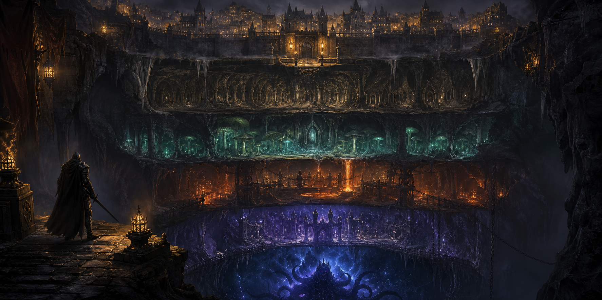
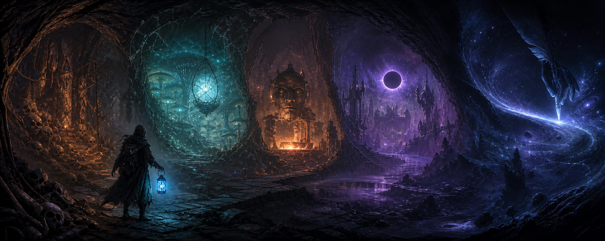
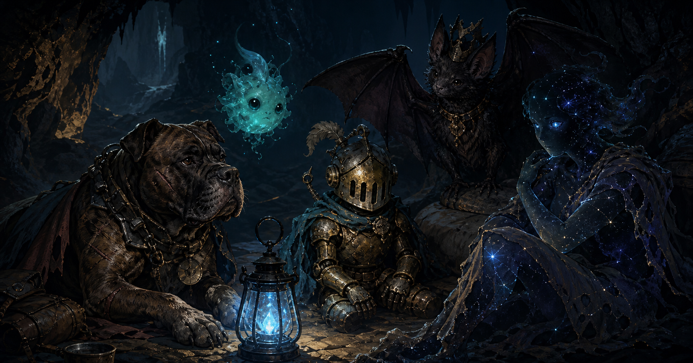
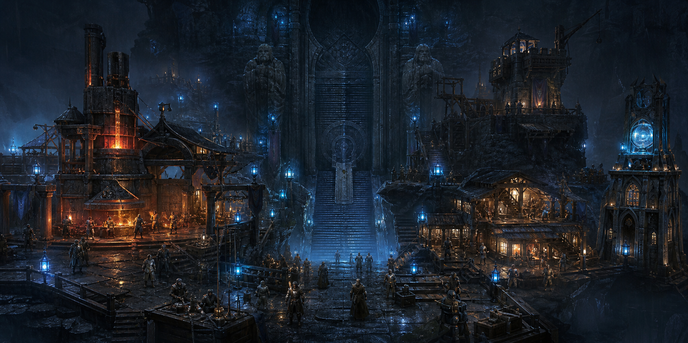

# deepdelve

A persistent, button-driven old-school text RPG for Red-DiscordBot.



[Back to the cog catalog](../README.md)

## The Game

Beneath Lastlight Outpost lies the Deep: an endless dungeon of monsters, treasure,
traps, forgotten shrines, consequential mysteries, and sealed boss chambers. Every
member creates a persistent character and explores one room at a time through Discord
embeds and buttons.

The 5.0 central loop is:

```text
Hub → choose a goal → spend declared energy → make a remembered choice → grow the world
```

Progress is saved after every action. An interrupted battle can be resumed with
`[p]deepdelve` or its persistent Resume button.



## Install

```text
[p]repo add taakoscogs https://github.com/TaakoOfficial/TaakosCogs
[p]cog install taakoscogs deepdelve
[p]load deepdelve
```

Start a character:

```text
[p]deepdelve create
```

All player commands are hybrid commands and can also be used through Discord slash
commands, such as `/deepdelve adventure`.

## Classes

| Class | Style | Signature Skill |
| --- | --- | --- |
| Vanguard | High health and defense | Shield Bash deals heavy damage and weakens enemies |
| Shadow | High attack, luck, and critical chance | Twin Fang performs two critical-capable strikes |
| Arcanist | High mana and spell damage | Arcane Lance ignores most enemy armor |

Prefix users can create a named character directly:

```text
[p]deepdelve create shadow Nyx
```

Without arguments, character creation uses an interactive class selector and the
member's current display name. New delvers then write a three-part origin by choosing
a background, moral alignment, and one of three class-specific origin weapons.

## Highlights

- Persistent per-server characters and saved combat encounters.
- A persistent origin sequence with nine starter weapons and build-defining early choices.
- Living Morality from −100 Umbral to +100 Radiant, shaped by actions rather than a menu choice.
- Mercy, Honesty, Ambition, and Ruthlessness convictions with a permanent Book of Deeds.
- Visible moral transformations, reactive NPC dialogue, morality-gated events, and combat powers.
- Menu-driven exploration, combat, quests, Atlas routes, inventory identification,
  professions, companions, commissions, story chapters, and town services.
- Five authored regions with distinct atmosphere, narration, lore, and materials.
- A six-act Living Chronicle with 36 scenes, 18 permanent decisions, four endings,
  three eight-quest faction arcs, and a consequence-aware Quest Journal.
- Resolve, 18 selectable Tenets, a rotating Oath Board, moral journeys, World Echoes,
  faction services, remembered NPC relationships, mail, and named Nemeses.
- An unlockable Atlas with ten named branching dungeons, checkpoints, hazards,
  authored mechanics, minibosses, bosses, secrets, and declared energy costs.
- Twelve permanent seasonal chapters, weekly profession commissions, recipe research,
  collection books, and a five-room personal Sanctum.
- Five interactive regional puzzle chambers with saved attempts, hints, failure
  consequences, streak rewards, and build-aware reward modifiers.
- Five collectible companions with levels, bond, combat statistics, exploration
  passives, and authored personalities.
- Four persistent professions with 25 levels, five ranks, daily gathering, preserved
  mastery when switching, and distinct crafting or exploration advantages.
- Server-wide Lastlight development with a shared treasury and four buildings, each
  providing four levels of permanent benefits.
- Five deterministic server-specific world events that rotate daily and alter enemy
  strength, rewards, puzzle frequency, and atmosphere.
- Consequence-bearing decisions influenced by class, attributes, items, and currency.
- Scalable enemies with named bosses on every fifth floor.
- Elite enemies with armor, frenzy, venom, life drain, or ancient power.
- Telegraphed enemy intentions, Defend, cooldowns, four abilities per class, and tactical conditions.
- Five attributes, class talent trees, nine subclasses, backgrounds, alignments, titles, scars, and blessings.
- 45 authored regional equipment bases with prefixes, suffixes, subclass sets, curses, and identification.
- 51 named relic identities, protected favorites, loot comparison, drop pity, and collection tracking.
- Permanent legendary and set records, set-drop pity, duplicate fragments, and missing-piece forging.
- Thirty-nine tactical consumables, thirty Living World recipes, five rumor-unlocked
  forge patterns, a 60-slot vault, and three loadouts.
- Five deterministic floor conditions, named minibosses, hidden rooms, impossible camps, and personal hunts.
- Common, Uncommon, Rare, Epic, and Legendary equipment.
- Legendary effects, set bonuses, inspection comparisons, +10 upgrades, shards, enchanting, and rerolling.
- Lastlight contracts, reputation, crafting materials, and a depth-scaled forge.
- Twenty hidden lore fragments and a personal expedition journal.
- Four recurring NPCs with relationship levels, evolving dialogue, and multi-stage personal quests.
- Four-member parties with cooperative roles and stat bonuses.
- Equipment auctions and persistent player guilds with perks, rankings, and shared vaults.
- Consensual arena wagers with escrow, records, and seasonal points.
- Server-wide raid bosses with contribution rankings and distributed rewards.
- Deterministic daily dungeons, five-wave rifts, seasonal ladders, and server-first records.
- Hardcore permanent death, Ascension, prestige, and permanent endgame rewards.
- Daily exploration turns that reset at midnight UTC.
- Experience, levels, gold, death penalties, and unlimited dungeon scaling.
- Achievements with gold rewards and personal creature bestiaries.
- Depth, level, kill, gold, and boss leaderboards.
- Configurable adventure channel and daily turn allowance.
- Versioned, automatic save migration, persistent world-boss controls, per-player
  synchronization, and administrator difficulty scaling.
- No external services or Python dependencies.

## Player Commands

The persistent game hub is the primary interface; ordinary play does not require
remembering subcommands. Commands remain available as shortcuts and for accessibility.

| Command | Description |
| --- | --- |
| `[p]deepdelve` | Open the persistent Living World game hub |
| `[p]deepdelve create [class] [name]` | Create a character |
| `[p]deepdelve adventure` | Explore a room or resume battle |
| `[p]deepdelve profile [member]` | View a character sheet |
| `[p]deepdelve living <section> [action] [target] [extra]` | Play quests, saga, Atlas, Tenets, oaths, relationships, seasons, commissions, and Sanctum systems |
| `[p]deepdelve inventory` | Equip and sell collected gear |
| `[p]deepdelve town` | Heal, restore mana, and buy potions |
| `[p]deepdelve achievements [member]` | View achievement progress |
| `[p]deepdelve bestiary` | View discovered enemies |
| `[p]deepdelve lore` | Read recovered lore fragments |
| `[p]deepdelve journal` | Read recent expedition history |
| `[p]deepdelve materials` | View crafting resources |
| `[p]deepdelve contract` | Visit the Lastlight contract board |
| `[p]deepdelve craft` | Forge a weapon, armor, or charm |
| `[p]deepdelve regions` | View discovered dungeon regions |
| `[p]deepdelve chronicle` | Open the solo campaign and living-world hub |
| `[p]deepdelve leaderboard [category]` | View server rankings |
| `[p]deepdelve retire` | Permanently delete your character |

`[p]delve` is a shorter alias for the main command.

## Advanced Command Groups

| Group | Systems |
| --- | --- |
| `[p]deepdelve progression` | Attributes, talents, backgrounds, alignment, subclass, title, and respec |
| `[p]deepdelve item` | Armory, stash, loadouts, favorites, supplies, patterns, collections, and relic systems |
| `[p]deepdelve npc` | Lastlight characters, relationships, and story quests |
| `[p]deepdelve party` | Party creation, joining, leaving, status, and cooperative roles |
| `[p]deepdelve auction` | Browse, list, buy, and cancel fixed-price equipment listings |
| `[p]deepdelve guild` | Player guilds, contributions, perks, rankings, and shared vaults |
| `[p]deepdelve arena` | Challenges, escrowed wagers, acceptance, declining, and cancellation |
| `[p]deepdelve endgame` | Rifts, daily dungeons, Hardcore, Ascension, seasons, and world bosses |
| `[p]deepdelve chronicle` | Campaign, tutorial, rumors, bestiary, recap, companions, professions, events, and town growth |

Use `[p]help deepdelve <group>` to see every subcommand and argument.

## The Living Chronicle

The main solo story spans five chapters from the Forgotten Warrens through the
Margin of the World. Each chapter contains three authored scenes and ends in one of
three permanent decisions. Those choices are recorded on the campaign panel and
grant small build bonuses, so two characters can finish with meaningfully different
histories and statistics.

```text
[p]deepdelve chronicle
[p]deepdelve chronicle tutorial
[p]deepdelve chronicle campaign
[p]deepdelve chronicle puzzle
```

Campaign scenes use a Continue Story button. Major decisions use dedicated buttons
and cannot be undone without retiring the character.

## Living Morality and Convictions

Alignment records what a delver believed when their origin was written. Living
Morality records what their actions demonstrate afterward. Campaign decisions and
consequential dungeon encounters shift a score from −100 Umbral to +100 Radiant,
while Mercy, Honesty, Ambition, and Ruthlessness track the motives beneath those
choices.

Repeated easy deeds rapidly lose influence and stop granting Morality after three
occurrences. Unique campaign choices are recorded once and cannot be farmed. As a
delver changes, their character-sheet color, aura description, NPC dialogue, shrines,
wanderer encounters, available titles, and certain dungeon solutions change with
them.

Established characters unlock a Conviction power. Using it creates Conviction
Fatigue; two later victories recharge it, while bosses, camps, the inn, and Ascension
clear the fatigue immediately:

- Radiant: Lantern Grace heals, cleanses, and protects.
- Uncommitted: Measured Gambit rewrites an enemy intention and restores resources.
- Umbral: Dread Claim wounds through armor and steals health.

Use `[p]deepdelve chronicle morality` for the complete moral sheet and
`[p]deepdelve chronicle deeds` for the permanent recent record.

## Companions and Professions



Companions unlock at milestone depths. One can be active at a time; victories build
XP and bond, improving its statistics and passive effects. The roster includes a
trap-finding tunnel hound, a mana-restoring spore wisp, a salvaging memory automaton,
an elite-hunting court familiar, and an Unwritten shade that can return spent time.

Blacksmith, Alchemist, Cartographer, and Relic Hunter professions each level to 25
through relevant activity. Members receive three manual gathering actions per UTC
day, while exploration and combat also grant profession experience. Switching paths
costs currency but preserves mastery in every learned profession.

## Lastlight and World Events



Every member can contribute currency to Lastlight's shared treasury. Administrators
spend it on the Deepforge, Lantern Infirmary, Forbidden Archive, or Lastlight Watch.
Their benefits feed directly into crafting, services, potions, campaign and puzzle
rewards, and daily turns.

Each server receives a deterministic daily world event. Black Rain, the Lantern
Festival, Shifting Stairs, the Hollow March, and the Quiet Deep change the risk and
reward profile of ordinary expeditions without requiring scheduled maintenance.

## Tactical Combat

Enemies reveal their next intention before every action. Intentions include measured
strikes, crushing blows, multi-hit flurries, defensive stances, curses, and healing.
Players can attack, defend, use a potion, flee, choose an unlocked ability, or deploy
one of fifteen regional tactical consumables from persistent combat selectors.

Every class unlocks abilities at levels 1, 4, 7, and 12. Leveling grants attribute
points and regular talent points. At level 10, each base class chooses one of three
permanent subclasses:

- Vanguard: Guardian, Berserker, or Warlord
- Shadow: Assassin, Duelist, or Trickster
- Arcanist: Elementalist, Necromancer, or Chronomancer

## Advanced Equipment

Equipment can carry a prefix, suffix, set identity, enchantment, binding, curse, or
legendary power. Rare relics may initially be unidentified. Inventory controls support
equipping, selling, dismantling, upgrading, enchanting, and rerolling. Item commands
provide detailed inspection, identification, curse cleansing, set bonuses, and the
permanent relic codex.

The expanded armory supports protected favorites, rarity-based auto-dismantling, a
60-slot Lastlight vault, three named equipment loadouts, collection summaries, and
five guaranteed-effect patterns learned by resolving regional rumors. Origin weapons
are bound keepsakes with a +3 ceiling and cannot be sold or dismantled.

Native relic powers and enchantment powers coexist, so enchanting never erases an
origin, pattern, suffix, boss, or legendary identity. Pattern forging always produces
its advertised power. Discovering two slots of a set and converting a weaker duplicate
into a fragment unlocks deterministic missing-piece forging with
`[p]deepdelve item completeset <set>`.

## Multiplayer and Endgame

Parties hold up to four delvers. Cooperative roles—Guardian, Striker, Support, and
Scout—add distinct bonuses. Player guilds level through contributions and world-boss
activity, unlocking economy, Luck, daily-turn, and raid-damage perks.

Arena wagers are consensual and escrowed: currency is withdrawn when a challenge is
created, paid only after acceptance, and refundable through decline or cancellation.
The auction house transfers real equipment and uses the selected DeepDelve economy.

Challenge rifts contain five escalating waves. Daily dungeons are deterministically
seeded from the UTC date so every server receives the same modifier; their effective
floor is bracketed near each delver's deepest progression.
World bosses are shared server encounters with individual attack cooldowns and
contribution-based rewards.

Ascension becomes available after floor 20 and four bosses. It resets combat
progression for permanent prestige and blessings while preserving lore, codex,
achievements, currency, reputation, titles, and social membership. Hardcore mode is
optional and must be selected before the first kill; a Hardcore combat death
permanently seals that character. Prestige combat bonuses cap after ten ranks while
later Ascensions continue to count toward the character's chronicle.

## Server Settings

Administrators and members with Manage Server can configure the game:

```text
[p]deepdelve set
[p]deepdelve set enabled true
[p]deepdelve set channel #adventures
[p]deepdelve set channel
[p]deepdelve set turns 24
[p]deepdelve set difficulty 1.00
[p]deepdelve set economy bank
[p]deepdelve set resetuser @member
```

The channel restriction applies to both commands and interactive exploration
buttons. Daily turns may be configured from 5 to 100. Difficulty may be set from
0.75× to 2.00× and scales enemy health, attack, defense, and rewards.

## Red Economy Integration

DeepDelve supports two per-server economy modes:

```text
[p]deepdelve set economy internal
[p]deepdelve set economy bank
```

- `internal` is the default and keeps dungeon gold isolated inside DeepDelve.
- `bank` uses Red's configured bank balance and currency name for the entire game.

In bank mode, monster and boss rewards, treasure, item sales, contracts,
achievements, crafting costs, town purchases, narrative choices, and death penalties
all directly affect the member's Red bank account. Gold leaderboards also read live
bank balances.

Balance changes are applied as transaction deltas. If another economy cog changes a
member's balance while an adventure is active, DeepDelve adds or subtracts only its
own transaction rather than replacing the outside change. Rewards respect Red's
configured maximum bank balance.

Switching to bank mode does not deposit existing internal dungeon gold. It becomes
inactive while the game uses the member's existing bank balance. Switching back uses
the character's most recently cached balance as internal gold.

## Gameplay Notes

- Exploring a new room costs one turn; combat actions do not.
- A floor contains five rooms. Every fifth floor ends with a boss.
- Fleeing becomes easier with Luck, but bosses are harder to escape.
- A normal defeated character loses 15% of their currency, may gain a cosmetic scar,
  retreats one floor, and is restored at Lastlight. Challenge failures instead
  restore the interrupted expedition. Hardcore deaths are permanent.
- Equipment packs hold 25 items. Loot found while full is converted into gold.
- Town prices scale with character level and dungeon depth.
- Region-specific materials drop from enemies and bosses. The forge consumes three
  units of the current region's material.
- Narrative encounters remain saved until the member makes a decision.
- Contracts progress through enemy victories and award reputation alongside currency
  and experience.
- Newly posted player controls remain usable across cog reloads and bot restarts.
  Controls are bound to their original delver; reopen older pre-4.0.1 screens with
  `[p]deepdelve adventure`.

## Permissions

The bot needs:

- Send Messages
- Embed Links
- Use External Emojis (only if required by the server's emoji configuration)

No privileged Discord intents are required.

## Data and Privacy

DeepDelve stores Discord user IDs and persistent game state per server. Stored data
includes character details, attributes, inventory, equipment, currency cache, dungeon
progress, active encounters and choices, conditions, crafting materials, contracts,
reputation, NPC stories, lore, journal entries, titles, scars, blessings,
achievements, social membership, arena records, endgame progress, seasonal progress,
campaign decisions, puzzle history, companions, professions, gathering activity,
town contributions, world-event discoveries, and discovered enemies. Server
configuration also stores party, auction, player-guild and shared-vault, arena,
world-boss, server-first, shared town, and contributor records. When bank mode is
enabled, DeepDelve reads and changes the member's Red bank balance for game transactions.

The cog implements Red's user-data export and deletion hooks. Players can also delete
their current server character directly with `[p]deepdelve retire`. No game data is
sent to an external service.

## Project Structure

DeepDelve is divided into focused modules:

- `content.py` contains original regions, enemies, bosses, events, and base loot.
- `advanced_content.py` contains abilities, talents, subclasses, sets, legendaries, NPCs, and seasons.
- `expansion_content.py` contains campaign chapters, puzzles, companions, professions,
  town buildings, world events, and the expanded enemy and boss roster.
- `systems/campaign.py` handles permanent story progression and choice bonuses.
- `systems/puzzles.py` handles puzzle selection, saved attempts, hints, and rewards.
- `systems/companions.py` handles collection, bond, leveling, and passive statistics.
- `systems/professions.py` handles profession ranks, experience, and gathering.
- `systems/world.py` handles deterministic events and shared town upgrades.
- `systems/migrations.py` performs idempotent profile and guild save upgrades.
- `living_content.py` contains validated 5.0 campaign, faction, dungeon, event,
  equipment, recipe, contract, and permanent-season definitions.
- `systems/quests.py`, `legacy.py`, and `relationships.py` handle the journal,
  Resolve/Tenets/factions, consequences, NPC memory, mail, and World Echoes.
- `systems/atlas.py`, `nemesis.py`, and `living_campaign.py` handle named expeditions,
  personal rivals, the six-act saga, and permanent endings.
- `systems/commissions.py`, `sanctum.py`, `season_archive.py`, and `economy.py` handle
  profession goals, capped sinks, archived chapters, reward budgets, and projections.
- `systems/content_registry.py` validates content counts, keys, references, and rewards.
- `systems/combat.py` handles enemy intentions.
- `systems/progression.py` calculates builds, titles, subclasses, talents, scars, and blessings.
- `systems/items.py` handles advanced procedural itemization and equipment operations.
- `systems/story.py` evaluates NPC relationships and story quests.
- `systems/social.py` supports parties, player guilds, arena ratings, and record IDs.
- `systems/endgame.py` produces seasons and deterministic daily challenges.
- `deepdelve.py` owns Red commands, persistence orchestration, and Discord interactions.

## Dashboard

DeepDelve registers a read-only Red-Web-Dashboard page showing server settings and
available commands. Individual player profiles are intentionally excluded.
